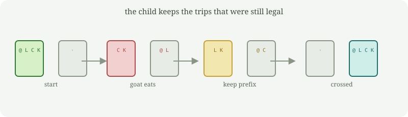

# cruzante

A small Rust program that tries to get a wolf, a goat, and a cabbage across a river, and **writes a child that keeps the trips that were still legal**.

It is not a language model and it does not spread by itself. You point it at a folder; it only writes there.

It is a sibling of the constructors that copy, search, prove, or chase a moving world. Those stay as they are. This one uses the same mold (embedded genome, one child, explicit destination) on a frozen riddle: the boat holds the farmer and one passenger. The wolf cannot be left with the goat. The goat cannot be left with the cabbage.

The part that evolves is a **plan**: a list of cargo (`lobo`, `cabra`, `col`, `nada`). The farmer always rows. If a move is illegal or someone gets eaten, that is the birth. The child inherits the prefix that survived and rewrites from the failure. It does not shuffle the trips that already worked.

```
parent    plan  lobo                         goat eats cabbage
  │ keep nothing (the first trip killed)
  ▼
          plan  cabra                        legal so far
  │ keep that trip, change the next
  ▼
child     plan  cabra nada lobo cabra col nada cabra
```



Watch it happen in the terminal. Left bank, water, right bank, and a **lineage** of decisions: `=` kept, `x` dumped, `+` wrote. `dish` defaults to seed 7.

```bash
cargo run -- dish
```

## Run it

You need [Rust](https://rustup.rs/).

```bash
cargo build --release
./target/release/cruzante identity
./target/release/cruzante evolve --steps 80 --spawn ./hijo --build
./hijo/target/debug/cruzante identity
```

`identity` prints generation, plan, and who is on each bank.  
`evolve --spawn ./hijo --build` searches, keeps legal prefixes, prints the lineage of keep/dump/write, and writes a child crate with the winning (or best) plan.

## Commands

```
cruzante identity              generation, lineage, plan, banks
cruzante eval [plan]           simulate this plan, or the current one
cruzante evolve                search; mutants copy the legal prefix
                 --steps N      search steps (default 80)
                 --lambda L     mutants per step (default 20)
                 --seed S       reproducible RNG
                 --spawn <dir>  write a child with the winner
                 --build        compile that child
                 --force        overwrite a previous child
                 --write        update src/main.rs in this project
cruzante dish                  animate the two banks and the decision lineage
                 --steps N      search steps (default 80)
                 --lambda L     mutants per step (default 20)
                 --seed S       default 7
                 --delay MS     ms per frame (default 80)
cruzante spawn <dir>           copy the current genome (no search)
cruzante genome                print the embedded sources
```

`--spawn` leaves this program alone and writes a selected child.  
`--write` edits this project's `src/main.rs`; rebuild so the binary picks up the new plan.

## How it works

The plan lives in a constant in `src/main.rs`.

1. Parse the current plan into cargo tokens.
2. Simulate from the left bank. Stop at the first illegal move or the first eating.
3. Each mutant **copies the legal prefix** and only changes what comes after.
4. Lower score is better: a full crossing beats a long prefix; a shorter winning plan beats a longer one.
5. Each time the champion improves, record a decision: what stayed (`=`), what was dumped (`x`), what was written (`+`).
6. With `--spawn`, write a full Cargo project whose source contains that plan.

There is no pathfinding algorithm inside. The river never changes. This is not a Gödel certificate: anyone can re-run `eval` on the plan.

## Safety

- One child per run. No background loops, no network.
- It will not write over your home directory, `/`, `/usr`, `/etc`, or the directory you are standing in.
- `--force` only deletes a folder that already looks like a `cruzante` project.

## Related

The mold (untouched):  
[replicator](https://github.com/PascualMacana/replicator) copies itself.  
[improver](https://github.com/PascualMacana/improver) searches against a frozen curve.  
[prover](https://github.com/PascualMacana/prover) only writes a claimed improvement with a checkable proof.  
[red-queen](https://github.com/PascualMacana/red-queen) keeps searching because the target itself moves.  
[inquirer](https://github.com/PascualMacana/inquirer) keeps the house assignments the clues did not refute.  
[tide](https://github.com/PascualMacana/tide) is this river with eating rules that hop after a crossing.  
[sealer](https://github.com/PascualMacana/sealer) is this river with a proof: a new plan is written only if re-simulation checks.  
[turn](https://github.com/PascualMacana/turn) keeps searching because the house clues hop.
